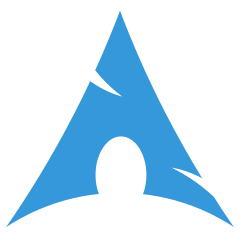

Hello there!

Iam **saikiran**, Currently learning and Working on <u>Full Stack Development</u> & DevOps. Going to be an active contibutor to GIT soon(currenlty exploring).
Beside programming, I love playing CS:GO.

A bit more of myself:

- Always working on something cool.
- Currently learning Full Stack Development and DevOps.
- Fun fact: I sleep for four hours in every 12 hours.
- I'm always open to have a chit-chat with you :)

You can also find me Here ↵

 

Technologies and Tools I use</b> 

     

 

<!---
Saikiranbelana/Saikiranbelana is a ✨ special ✨ repository because its `README.md` (this file) appears on your GitHub profile.
You can click the Preview link to take a look at your changes.
--->

